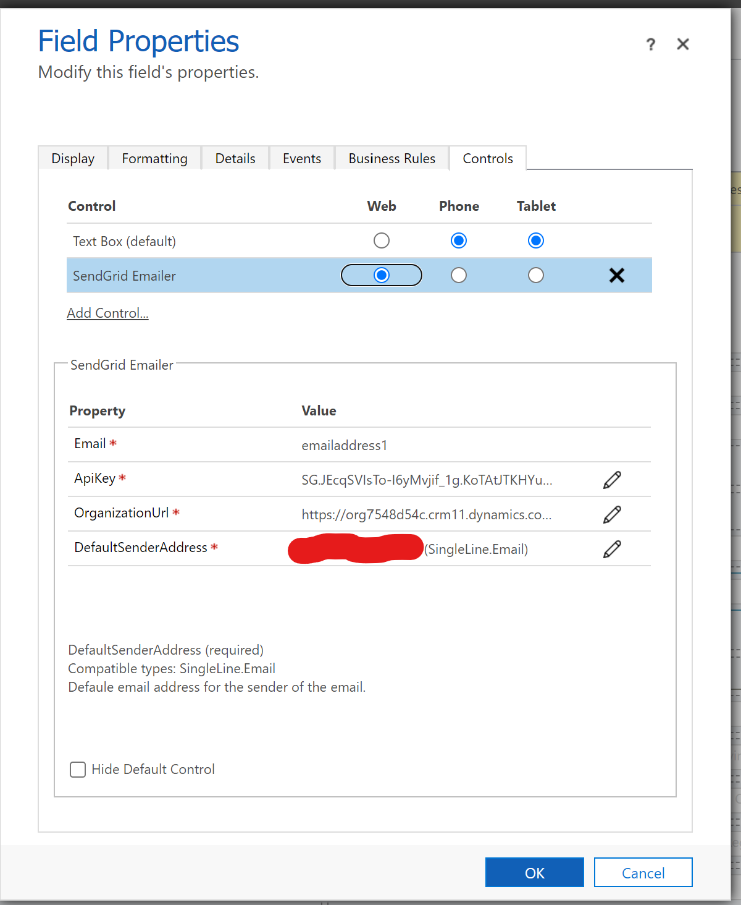
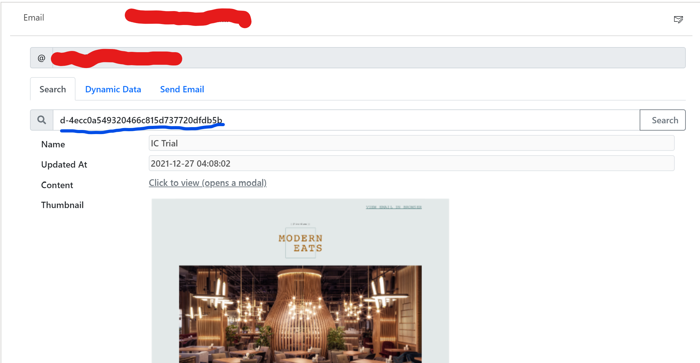
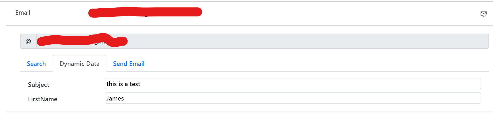
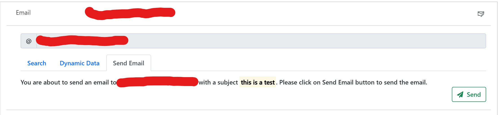
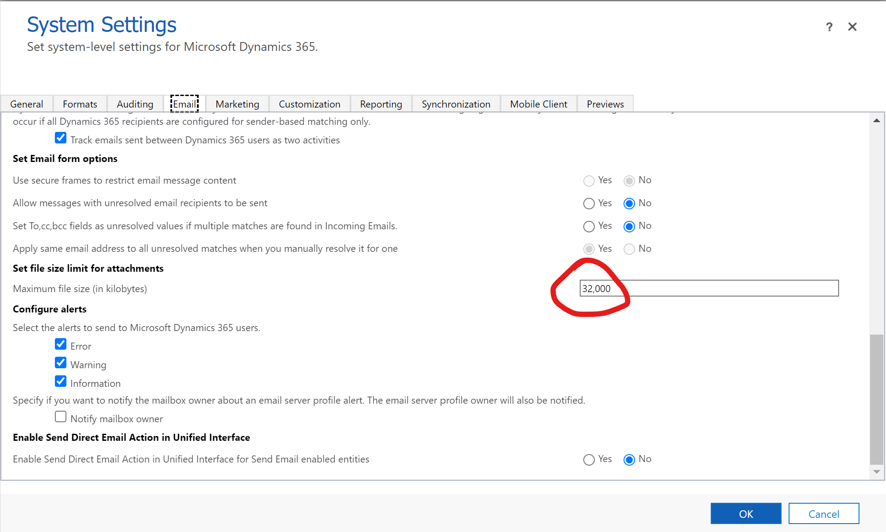

# Codebug Sendgrid Emailer
This is a Power App Component Framework that sends template based emails via [Sendgrid](https://sendgrid.com/). The PCF also gives the user template search capability and once the template is found it will show a small image of the template from Sendgrid store so that the user know the what the content will look like when the email is reached the customer. Some template in Send grid might have some Dynamic field. this PCF will display the dynamic field and will let the user set the dynamic fields before sending the email.

## Configuration
### Installation 
Download the soution for the release location of this Github repository. We recommend dowloading the combined solution but if you want then you can install the solution separately. if you have chosen the individual deployment, please intall the `CodebugSendgridEmailerAction` solution first.

### Setting up the control
> This control is bound to an email field. Please make sure the field that you are binding the control to is a single line of text with the type of email. if the field is not en email the control will not show in the controls list.
* Open the form in which you want to add the control
* Find the email field which the control is replacing.
* Set the following property
	* Email - Email (bound) - This is the field to which the control is bound|
	* Api Key - String - ApiKey from send grid. to learn how to generate   	api  key, check out this [link](https://docs.sendgrid.com/ui/account-and-settings/api-keys)
	* DynamicsUrl - string - Url of the dataverse/dynamics instance. An example is https://YOUR-ORG.crm11.dynamics.com. make sure the there is no trailing `/` at the end of the url. For more information as to why do you need it.
	* DefaultSenderAddress - string - Email address of the sender
	
* Once the control is set up correctly place it is the form. for the best viewability. set the control in a one column section.
### Sending the first email
 * Search with the sendgrid template. Only transactional template is supported. Legacy template is not supported and may show untested result.
 
 * Set the dynamic data in the next tab.
 
 * Confirm the details and send the email.
 

# Gotchas
-   While importing, the if the Dataverse environment complains the size of the package is too big then go to **Settings** > **Administration** > **System Settings**. under the email tab find the file size attachment and increase the number.
    
-  This pcf is not supported for the legacy templates in sendgrid.
-   Browser based send email is not possible via SendGrid. More information is in their [official documentation](https://docs.sendgrid.com/for-developers/sending-email/cors#browser-only-applications).
-   Both `context.WebApi.Execute`  and `context.Page.getClientUrl()` is available in the context object. However they are not present in the TypeScript definition and hence using these methods within PCF are not supported.

For the above two reasons this control accepts a parameter for Dynamics' organisation url and does an Api call to a Dynamics action which in turn calls the SendGrid Api. The code activity used in the function is also added in the repository. I have associated three different variations of the solutions

-   A solution containing both the control and the action.
-   A solution containing only the Action
-   A solution containing the PCF control.